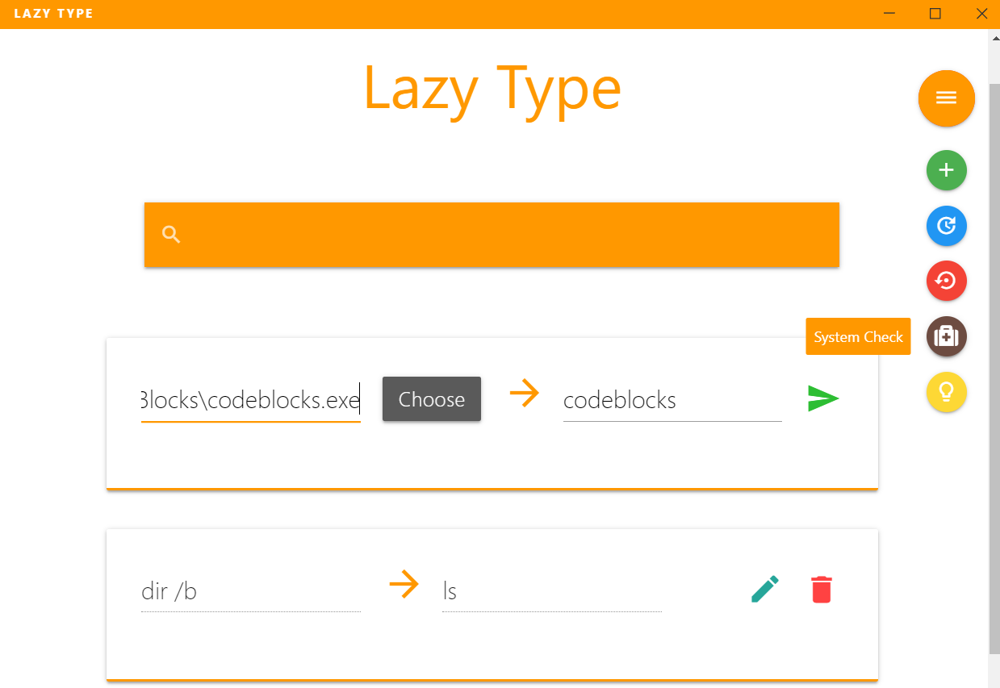

[](https://github.com/ngudbhav/lazyType/releases)
[](https://github.com/ngudbhav/lazyType/blob/master/package.json)
[](https://github.com/ngudbhav/lazyType/releases)
[](https://github.com/ngudbhav/lazType/releases)
[](https://github.com/ngudbhav/lazyType/releases)

# Lazy Type

A Software to create aliases for commands, applications to type in cmd, terminal. Just type the original command and type an alias for it. You can also assign a program for it. Browse through the directory to find the program or anything executable using the command line and you can create an alias for the same. Only Windows is supported for releases.

<h4 align="center">
<a href="https://github.com/ngudbhav/lazyType/releases/download/v1.0.0/Setupx64.exe">Download for Windows (x64) </a><a href="https://github.com/ngudbhav/lazyType/releases/download/v1.0.0/Setupx86.exe"> Download for Windows (x86)</a></h4>



## Features

**Shortcut for Command/File**

Point a command either to an existing system command or to an executable file.

**Backup/Restore Utility**

Move all the commands to and fro a new/already configured system.

**Configuration Checkup Inbuilt**

Launch the utility from the app itself if there is a problem with the commands.

## Building/Testing

You need g++ in your path to build/test the code. The code uses MINGW++ compiler. Also, electron must be installed globally in the system.

```sh
npm install -g electron
git clone https://github.com/ngudbhav/lazyType.git
cd lazyType
npm install
g++ config.cpp -o ConfigUtility.exe resource.res
npm start
```

## Installing The App

```sh
Setupx64.exe => Full Windows install for 64-bit Windows.
Setupx86.exe => Full Windows install for 32-bit Windows.
```

## Contributing

Big Kudos to <a href="http://github.com/hit-11">Hitesh Peswani</a> for his incredible UI contributions.

We encourage you to contribute to Lazy Type!

We expect contributors to abide by our underlying [code of conduct](./CODE_OF_CONDUCT.md).
All conversations and discussions on GitHub (issues, pull requests)
must be respectful and harassment-free.

<a href="https://www.buymeacoffee.com/ngudbhav" target="_blank"></a>

## License

This project is licensed under the MIT License - see the LICENSE.md file for details.
